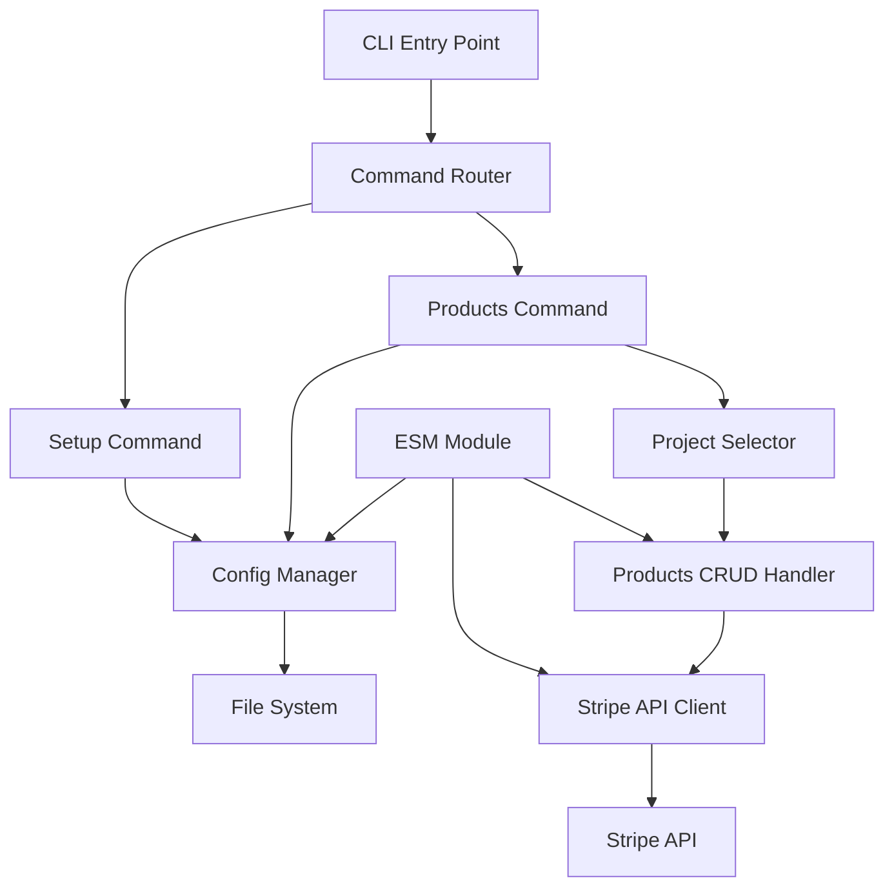
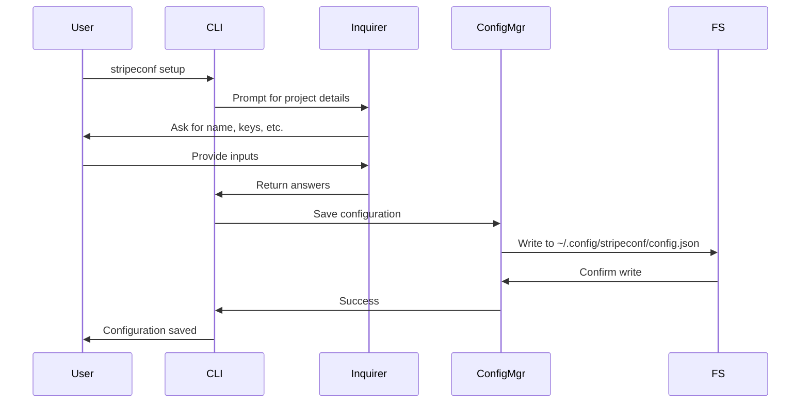
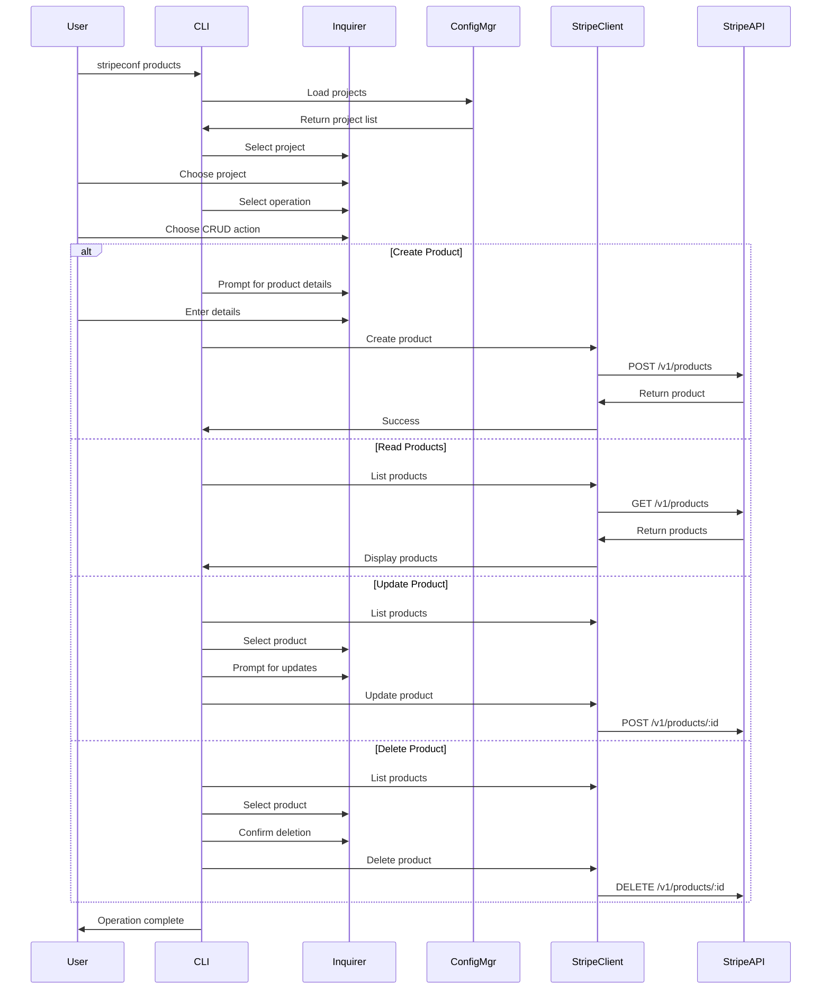

# Stripe Configuration Tool - Architecture

## Overview
A CLI tool and ESM module for managing Stripe products with multi-project configuration support.

## System Architecture



## Project Structure

```
stripe-config/
├── src/
│   ├── cli/
│   │   ├── index.ts              # CLI entry point
│   │   ├── commands/
│   │   │   ├── setup.ts          # Setup command handler
│   │   │   └── products.ts       # Products command handler
│   │   └── prompts/
│   │       ├── setup-prompts.ts  # Setup inquirer prompts
│   │       └── product-prompts.ts # Product CRUD prompts
│   ├── core/
│   │   ├── config-manager.ts     # Config file management
│   │   ├── stripe-client.ts      # Stripe API wrapper
│   │   └── types.ts              # TypeScript interfaces
│   ├── lib/
│   │   ├── products.ts           # Product CRUD operations
│   │   ├── validators.ts         # Input validation
│   │   └── formatters.ts         # Output formatting
│   └── index.ts                  # ESM module exports
├── dist/                         # Compiled output
├── package.json
├── tsconfig.json
└── README.md
```

## Configuration Storage

**Location:** `~/.config/stripeconf/config.json`

**Structure:**
```json
{
  "projects": [
    {
      "name": "my-project",
      "environment": "test",
      "publishableKey": "pk_test_...",
      "secretKey": "sk_test_...",
      "webhookSecret": "whsec_...",
      "defaultCurrency": "usd"
    }
  ],
  "defaultProject": "my-project"
}
```

## Command Flow

### Setup Command Flow


### Products Command Flow


## Key Components

### 1. Config Manager
- Manages `~/.config/stripeconf/config.json`
- CRUD operations for project configurations
- Validates configuration structure
- Handles file system permissions

### 2. Stripe Client
- Wraps Stripe SDK
- Handles authentication per project
- Provides typed methods for product operations
- Error handling and retry logic

### 3. Products Handler
- List all products with pagination
- Create products with all fields:
  - name, description
  - multiple prices (amount, currency, recurring)
  - active status
  - metadata (key-value pairs)
  - images (URLs)
  - tax_code
- Update existing products
- Delete products with confirmation

### 4. CLI Commands
- `stripeconf setup` - Interactive project setup
- `stripeconf products` - Product management interface
- Future: `stripeconf prices`, `stripeconf customers`, etc.

### 5. ESM Module Interface
Programmatic access for Node.js applications:
```typescript
import { StripeConfig, ProductManager } from '@yourorg/stripeconf';

const config = new StripeConfig();
const project = await config.getProject('my-project');
const products = new ProductManager(project);

await products.create({
  name: 'Premium Plan',
  description: 'Full access',
  prices: [{ amount: 2999, currency: 'usd' }]
});
```

## Technology Stack

- **Runtime:** Node.js
- **Package Manager:** pnpm
- **Language:** TypeScript
- **CLI Framework:** commander
- **Prompts:** inquirer
- **Stripe SDK:** stripe (official)
- **Build Tool:** tsc (TypeScript compiler)
- **Module Format:** ESM (ES Modules)

## Product Fields Support

### Basic Fields
- `name` (required)
- `description`
- `active` (boolean)

### Pricing
- Multiple price points
- `amount` (in cents)
- `currency` (ISO code)
- `recurring` (interval, interval_count)
- `billing_scheme` (per_unit, tiered)

### Advanced Fields
- `metadata` (custom key-value pairs)
- `images` (array of URLs)
- `tax_code` (Stripe tax code)
- `unit_label` (e.g., "seat", "GB")
- `statement_descriptor`

## Error Handling

1. **Configuration Errors**
   - Missing config file → prompt to run setup
   - Invalid JSON → clear error message
   - Missing required fields → validation errors

2. **API Errors**
   - Authentication failures → check API keys
   - Rate limiting → retry with backoff
   - Invalid requests → detailed error messages

3. **User Input Errors**
   - Validation before API calls
   - Clear error messages
   - Ability to retry/correct

## Security Considerations

1. **API Key Storage**
   - Stored in `~/.config` (user-only permissions)
   - Never logged or displayed
   - Masked in error messages

2. **File Permissions**
   - Config file: 0600 (read/write owner only)
   - Config directory: 0700 (full access owner only)

3. **Input Validation**
   - Sanitize all user inputs
   - Validate against Stripe API requirements
   - Prevent injection attacks

## Testing Strategy

1. **Unit Tests**
   - Config manager operations
   - Stripe client methods
   - Validators and formatters

2. **Integration Tests**
   - CLI command execution
   - Stripe API interactions (test mode)
   - File system operations

3. **E2E Tests**
   - Full command workflows
   - Multi-project scenarios
   - Error recovery

## Future Enhancements

- Support for other Stripe resources (prices, customers, subscriptions)
- Export/import configurations
- Bulk operations
- Configuration templates
- Webhook testing tools
- Analytics and reporting